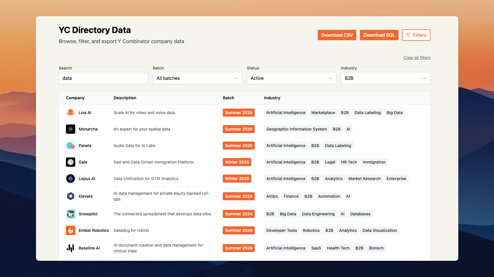

# YC Directory Data

> Browse, filter, and export Y Combinator company data



A modern web application for exploring Y Combinator's portfolio of 5,400+ companies. Built with Next.js and powered by the community-maintained [yc-oss/api](https://github.com/yc-oss/api).

## Features

- **Browse & Filter**: View and filter through 5,400+ YC companies with search, batch, status, and industry filters
- **Multiple Export Formats**: Export data as CSV or SQL
- **Real-time Data**: Fetches live data from the yc-oss public API
- **Modern UI**: Clean, responsive interface built with Tailwind CSS
- **No Authentication Required**: Uses publicly available API endpoints
- **Pagination**: Efficiently browse large datasets with 25 companies per page

## Prerequisites

- Node.js 18+
- npm or yarn
- Internet connection (for API access)

## Installation

1. Clone the repository:

```bash
git clone <repository-url>
cd yc-directory-data
```

2. Install dependencies:

```bash
npm install
```

3. No additional setup required! The application uses the public yc-oss API which requires no authentication.

## Usage

1. Start the development server:

```bash
npm run dev
```

2. Open [http://localhost:3000](http://localhost:3000) in your browser

3. Browse and filter the YC companies data

4. Use the export buttons to download data in your preferred format:
   - **CSV**: Spreadsheet-compatible format
   - **SQL**: Database-ready INSERT statements

## API Endpoints

- `GET /api/fetch-yc-all` - Returns all YC companies (5,400+ companies) for browsing and export

## Data Source

This application uses the [yc-oss/api](https://github.com/yc-oss/api) public API, which:

- Aggregates data from the official YC Directory
- Updates daily via GitHub Actions
- Provides JSON endpoints for all YC companies and top companies
- Requires no authentication
- Is community-maintained and publicly available

**API Documentation**: [https://github.com/yc-oss/api](https://github.com/yc-oss/api)

**Data Source:**

- **All Data**: Loads all 5,400+ YC companies on page load for browsing, filtering, and export

## Data Structure

Each company record includes:

- `company_name`: Company name
- `short_description`: Company one-liner description
- `batch`: YC batch (e.g., "Summer 2013", "W24")
- `industry`: Company industry tags
- `location`: Company location (city, country)
- `year_founded`: Year the company was founded
- `team_size`: Number of team members
- `status`: Company status (Public, Private, etc.)
- `is_hiring`: Whether the company is currently hiring (Yes/No)
- `top_company`: Whether it's a top YC company (Yes/No)
- `nonprofit`: Whether it's a nonprofit organization (Yes/No)
- `website`: Company website URL

## Tech Stack

- **Framework**: Next.js 14
- **Language**: TypeScript
- **Styling**: Tailwind CSS
- **Data Export**: json2csv, PapaParse
- **API**: yc-oss public API

## Project Structure

```
├── app/
│   ├── api/
│   │   └── fetch-yc-all/route.ts      # API to fetch all companies
│   ├── layout.tsx                     # App layout
│   └── page.tsx                       # Main page
├── components/
│   ├── CompanyTable.tsx               # Data table component
│   ├── ExportButtons.tsx              # Export functionality
│   ├── Filters.tsx                    # Filter controls
│   └── Pagination.tsx                 # Pagination component
├── lib/
│   └── export.ts                      # Export utilities
└── styles/
    └── globals.css                    # Global styles
```

## Contributing

1. Fork the repository
2. Create a feature branch
3. Make your changes
4. Test thoroughly
5. Submit a pull request

## License

This project is for educational and research purposes.

## Technical Considerations

- Uses the community-maintained [yc-oss/api](https://github.com/yc-oss/api)
- No authentication or API keys required
- Data is fetched from legitimate public endpoints
- All data is publicly available and community-maintained

## Disclaimer

This tool is not affiliated with Y Combinator. The data is sourced from the community-maintained yc-oss API.
